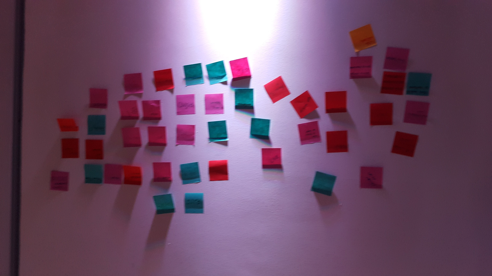
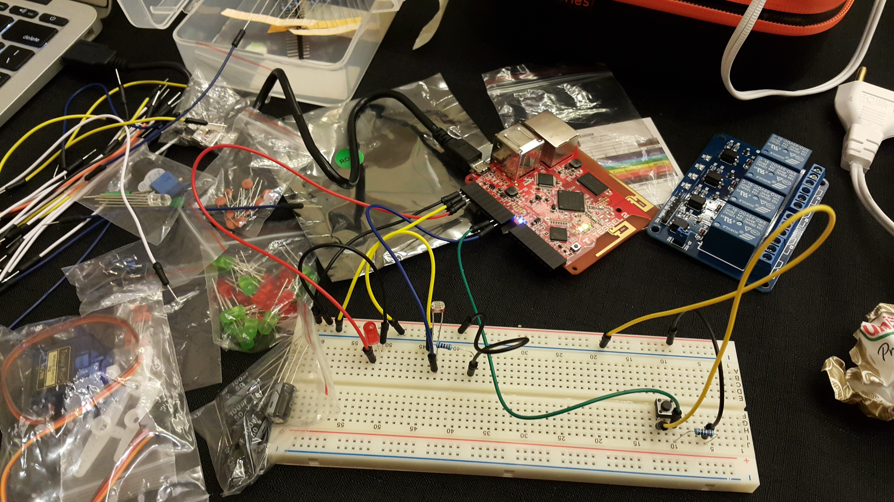
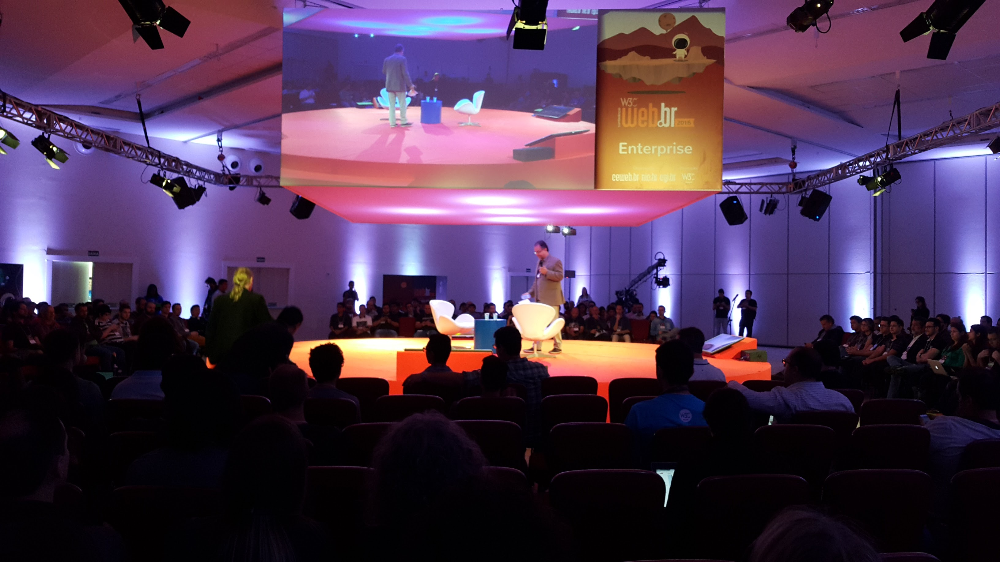

# Micro Atividade de Feedback
Pedimos aos presentes que preenchessem post-its com os items que eles:

* Gostaram ou o que deu certo
* O que eles não gostaram ou que deu errado
* O que eles gostariam de aprender no futuro.

## O que gostaram / o que deu certo

* Dinâmica x 6
* Prática x 5
* Simplicidade de programar hardware em JS x 2
* Nosso LED deu certo x 2
* Improviso x 1
* Workshop x 1
* Introdução a parte básica x 1

**Total: 18 items**

## O que não gostaram / o que deu errado

* A falta de computador x 4
* Pouco tempo x 2
* Mais conteúdo de hardware x 1
* Dificuldade com as portas x 1
* Faltou mesas x 1

**Total: 9 items**

## O que querem aprender no futuro

* Projetos práticos do início ao fim x 3
* Mais componentes do Tessel x 2
* Raspberry Pi x 1
* Conhecer outras placas x 1
* Mais post-its x 1
* Novos comandos x 1
* programar x 1

**Total: 10 items**

# Conclusão

As pessoas gostaram muito da pegada prática do workshop e das dinâmicas de grupo. Programar hardware em JS é simples e reduz a fricção de começar a programar para a computação física.

A falta de computadores foi um problema real e a percepção que uma hora e meia de workshop é pouco tempo fala mais a favor do workshop do que contra rsrsrs.

Ter um projeto realizado do início ao fim é uma boa forma de engajar os oficineiros no futuro e o Tessel foi bem recebido!

